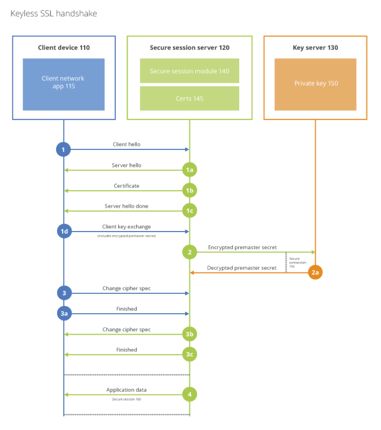

# Go Keyless
[](https://travis-ci.org/cloudflare/gokeyless)
[](https://godoc.org/github.com/cloudflare/gokeyless)


## Keyless SSL implementation in Go
Go Keyless is an implementation CloudFlare's [Keyless SSL](https://blog.cloudflare.com/keyless-ssl-the-nitty-gritty-technical-details/) Protocol in Go. It is provided as
an upgrade to the previous [C implementation](https://github.com/cloudflare/keyless).

## Protocol

The CloudFlare Keyless SSL client communicates to the server via a binary
protocol over a mutually authenticated TLS 1.2 tunnel.  Messages are in binary
format and identified by a unique ID.

Messages consist of a fixed length header, and a variable length body.  The
body of the message consists of a sequence of items in TLV (tag, length,
value) messages.

All messages with major version 1 will conform to the following
format.  The minor version is currently set to 0 and is reserved for
communicating policy information.

Header:

    0 - - 1 - - 2 - - 3 - - 4 - - - - 6 - - 7 - - 8
    | Maj | Min |   Length  |          ID           |
    |                    Body                       |
    |     Body     | <- 8 + Length

Item:

    0 - - 1 - - 2 - - 3 - - 4 - - - - 6 - - 7 - - 8
    | Tag |   Length  |          Data               |
    |           Data             | <- 3 + Length

All numbers are in network byte order (big endian).

The following tag values are possible for items:

    0x01 - Certificate Digest,
    0x02 - Server Name Indication,
    0x03 - Client's IP address,
    0x11 - Opcode,
    0x12 - Payload,

A requests contains a header and the following items:

    0x01 - length: 32 bytes, data: SHA256 of RSA modulus
    0x02 - length: variable, data: SNI string
    0x03 - length: 4 or 16 bytes, data: IPv4/6 address
    0x11 - length: 1, data: opcode describing operation
    0x12 - length: variable, data: payload to sign or encrypt

The following opcodes are supported in the opcode item:

    0x01 - operation: RSA decrypt payload 
    0x02 - operation: RSA sign MD5SHA1
    0x03 - operation: RSA sign SHA1
    0x04 - operation: RSA sign SHA224
    0x05 - operation: RSA sign SHA256
    0x06 - operation: RSA sign SHA384
    0x07 - operation: RSA sign SHA512
    0x08 - operation: RSA raw decrypt payload
    0x12 - operation: ECDSA sign MD5SHA1
    0x13 - operation: ECDSA sign SHA1
    0x14 - operation: ECDSA sign SHA224
    0x15 - operation: ECDSA sign SHA256
    0x16 - operation: ECDSA sign SHA384
    0x17 - operation: ECDSA sign SHA512

Responses contain a header with a matching ID and only two items:

    0x11 - length: 1, data: opcode describing operation status
    0x12 - length: variable, data: payload response

The following opcodes are supported in the opcode item:

    0xF0 - operation: success, payload: modified payload
    0xFF - operation: RSA decrypt payload, payload: 

On an error, these are the possible 1-byte payloads:

    0x01 - cryptography failure
    0x02 - key not found - no matching certificate ID
    0x03 - read error - disk read failure
    0x04 - version mismatch - unsupported version incorrect
    0x05 - bad opcode - use of unknown opcode in request
    0x06 - unexpected opcode - use of response opcode in request
    0x07 - format error - malformed message
    0x08 - internal error - memory or other internal error

Defines and further details of the protocol can be found in [kssl.h](kssl.h)



## Key Management

The Keyless SSL server is a TLS server and therefore requires cryptographic
keys. All requests are mutually authenticated, so both the client and the
server need a TLS 1.2 compatible key pair. The client must present a client
certificate that can be verified against the CA that the keyless server is
configured to use.

The server will need a valid key and certificate pair in PEM format.  The
following options are required and take a path to these files. These two
parameters set up the certificate (and associated private key) that will be
presented by the server when a client connects.

     --server-cert 
     --server-key

The private keys that this server is able to use should be stored in
PEM format in a directory denoted by the option:

    --private-key-directory

In order to authenticate the client's certificate, a custom CA file is
required.  This CA file available is provided by CloudFlare and specified
with:

    --ca-file

# Deploying 

## Installing

### Package Installation
Instructions for installing Go Keyless from `.deb` and `.rpm` packages can be found at [https://pkg.cloudflare.com](https://pkg.cloudflare.com/).

### Source Installation
Compiling Go Keyless requires Go 1.5. Binary distributions can be found at [golang.org/dl](https://golang.org/dl/), under `go1.5`.

Installing the appropriate package for your operating system should leave you with a  [working Go
installation](http://golang.org/doc/install) and a properly set `GOPATH`.

```
$ go get -u github.com/cloudflare/gokeyless/...
$ go install github.com/cloudflare/gokeyless/cmd/gokeyless/...
```

## Running

### Command-line Arguments

This is the keyserver for Keyless SSL. It consists of a single binary file
`gokeyless` that has the following command-line options:

- `-port` (optional) The TCP port on which to listen for connections. These
  connections must be TLSv1.2. Defaults to 2407.
- `-ca-file` Path to a PEM-encoded file containing the CA certificate(s) used to
  sign client certificates presented on connection.
- `-cert`, `-key` Path to PEM-encoded files containing the
  certificate and private key that are used when a connection is made to the
  server. These must be signed by an authority that the client side recognizes.
- `--private-key-directory` Path to a directory containing private keys which
  the keyserver provides decoding service against. The key files must end with
  ".key" and be PEM-encoded. There should be no trailing / on the path.
- `-loglevel` (optional) Level of logging as [defined here](https://godoc.org/github.com/cloudflare/cfssl/log#pkg-constants). Defaults to `LevelInfo`.
- `-pid-file` (optional) Path to a file into which the PID of the
  keyserver. This file is only written if the keyserver starts successfully.

## License

See the LICENSE file for details. Note: the license for this project is not
'open source' as described in the [Open Source
Definition](http://opensource.org/osd).
